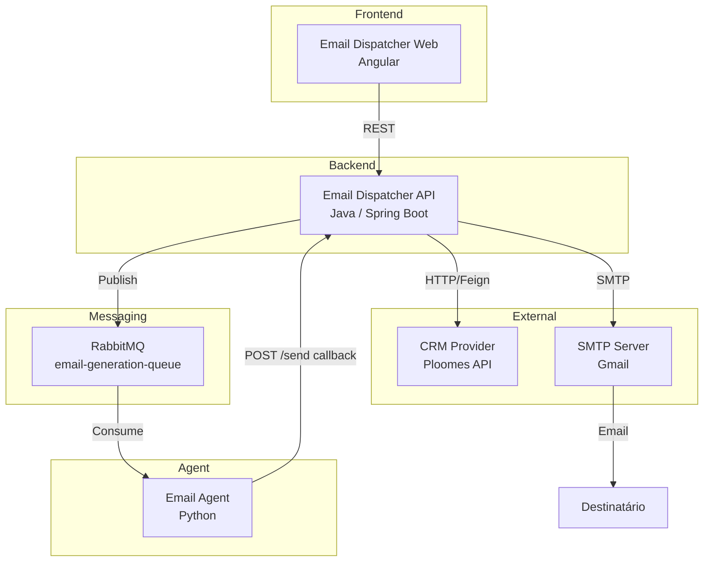
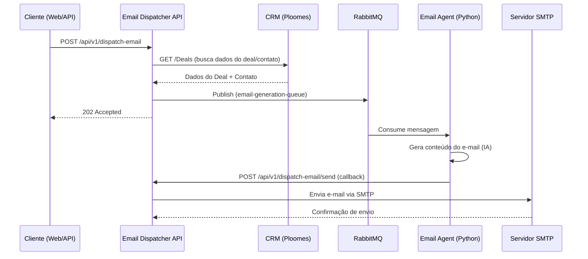
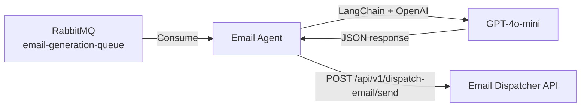

# Email Dispatcher

Monorepo contendo todas as aplicações e configurações para rodar o projeto **Email Dispatcher** — um sistema de disparo de e-mails inteligentes integrado a CRMs.
Projeto feito para a disciplina Clean Code e Padrões de Projeto do curso MIT em Engenharia de Software da Infnet.

## Sumário

- [Visão Geral](#visão-geral)
- [Arquitetura do Sistema](#arquitetura-do-sistema)
- [Fluxo de Funcionamento](#fluxo-de-funcionamento)
- [Estrutura do Projeto](#estrutura-do-projeto)
- [Email Dispatcher API (Java)](#email-dispatcher-api-java)
  - [Tecnologias](#tecnologias)
  - [Arquitetura Hexagonal](#arquitetura-hexagonal)
  - [Endpoints](#endpoints)
  - [Modelos de Domínio](#modelos-de-domínio)
  - [Configurações](#configurações)
- [Email Agent (Python)](#email-agent-python)
- [Email Dispatcher Web (Angular)](#email-dispatcher-web-angular)
- [Como Rodar o Projeto](#como-rodar-o-projeto)
  - [Pré-requisitos](#pré-requisitos)
  - [Rodando com Docker Compose](#rodando-com-docker-compose)
  - [Rodando Manualmente (Desenvolvimento)](#rodando-manualmente-desenvolvimento)
- [Variáveis de Ambiente](#variáveis-de-ambiente)

---

## Visão Geral

O **Email Dispatcher** é um sistema que automatiza o envio de e-mails personalizados a partir de dados de CRM. Ele consulta informações de deals/contatos em plataformas de CRM (atualmente Ploomes), gera conteúdo de e-mail via um agente de IA e realiza o envio via SMTP.

O sistema é composto por três aplicações principais:

| Serviço | Tecnologia | Descrição |
|---------|-----------|-----------|
| **email-dispatcher-api** | Java 21 / Spring Boot 4 | Backend REST que orquestra o fluxo de dados |
| **email-agent** | Python | Agente que consome a fila e gera o conteúdo do e-mail |
| **email-dispatcher-web** | Angular 17 | Interface web para gerenciamento |

---

## Arquitetura do Sistema



### Diagrama de Fluxo Detalhado



---

## Fluxo de Funcionamento

1. **Solicitação de Disparo** — O cliente (web ou chamada direta à API) envia uma requisição `POST /api/v1/dispatch-email` com informações do deal/contato.
2. **Consulta ao CRM** — A API consulta os dados completos do deal e contato no CRM (Ploomes) via Feign Client.
3. **Publicação na Fila** — A API publica uma mensagem na fila `email-generation-queue` do RabbitMQ com os dados necessários para geração do e-mail.
4. **Resposta Assíncrona** — A API retorna `202 Accepted` ao cliente imediatamente (processamento assíncrono).
5. **Consumo pelo Agent** — O `email-agent` (Python) consome a mensagem da fila e gera o conteúdo personalizado do e-mail.
6. **Callback de Envio** — O agent faz um `POST /api/v1/dispatch-email/send` (callback) na API com o e-mail pronto (destinatário, assunto, corpo).
7. **Envio via SMTP** — A API recebe o callback e envia o e-mail via servidor SMTP configurado.

---

## Estrutura do Projeto

```
email-dispatcher/
├── README.md
├── .gitignore
├── docker-compose.yml
├── .env
│
├── infra/
│   └── rabbitmq/
│       └── rabbitmq.conf
│
├── email-dispatcher-api/          ← Backend Java (implementado)
│   ├── docker/Dockerfile
│   ├── pom.xml
│   ├── src/
│   └── ...
│
├── email-agent/                   ← Agente Python (implementado)
│   ├── Dockerfile
│   ├── pyproject.toml
│   ├── app/
│   └── ...
│
└── email-dispatcher-web/          ← Frontend Angular
    ├── Dockerfile
    ├── package.json
    ├── src/
    └── ...
```

---

## Email Dispatcher API (Java)

### Tecnologias

| Tecnologia | Versão | Uso |
|-----------|--------|-----|
| Java | 21 | Linguagem principal |
| Spring Boot | 4.0.7 | Framework base |
| Spring Cloud OpenFeign | 2025.1.2 | Cliente HTTP declarativo |
| Spring AMQP | - | Integração com RabbitMQ |
| Spring Mail | - | Envio de e-mails SMTP |
| SpringDoc OpenAPI | 3.0.2 | Documentação Swagger UI |
| Lombok | - | Redução de boilerplate |
| Maven | - | Build e gerenciamento de dependências |

### Arquitetura Hexagonal

A API segue o padrão de **Arquitetura Hexagonal (Ports & Adapters)**, separando claramente as responsabilidades:

```
src/main/java/com/infnet/emaildispatcher/
├── adapter/
│   ├── in/                          ← Adaptadores de Entrada
│   │   ├── crm/                     (Controllers REST)
│   │   └── email/
│   └── out/                         ← Adaptadores de Saída
│       ├── http/crm/ploomes/        (Feign Client - CRM)
│       ├── messaging/rabbitmq/      (Publisher RabbitMQ)
│       └── smtp/                    (Sender SMTP)
│
├── application/
│   ├── domain/model/                ← Modelos de Domínio
│   │   ├── crm/                     (Deal, Contact)
│   │   └── email/                   (Email, EmailGeneration)
│   ├── port/
│   │   ├── in/                      ← Portas de Entrada (interfaces)
│   │   └── out/                     ← Portas de Saída (interfaces)
│   └── usecase/                     ← Casos de Uso (lógica de negócio)
│
└── config/                          ← Configurações Spring
```

**Princípios aplicados:**
- **Inversão de dependência** — Os use cases dependem de interfaces (ports), não de implementações concretas.
- **Factory Pattern** — `CrmProviderFactory` permite trocar o provedor de CRM (Ploomes, RD Station, HubSpot, Pipedrive, Salesforce) sem alterar a lógica de negócio.
- **Separação de camadas** — Controllers não conhecem detalhes de implementação; Use Cases não sabem sobre HTTP ou RabbitMQ.

### Endpoints

#### CRM (`/api/v1/crm`)

| Método | Path | Descrição | Response |
|--------|------|-----------|----------|
| `GET` | `/api/v1/crm/deals` | Retorna todos os deals do CRM | `GetAllDealsResponse` |
| `GET` | `/api/v1/crm/deals/{dealId}` | Retorna um deal específico com dados do contato | `GetDealByIdResponse` |

**Exemplo de resposta `GET /api/v1/crm/deals`:**
```json
{
  "value": [
    {
      "id": 123,
      "title": "Deal Example",
      "contact": {
        "id": 456,
        "name": "João Silva",
        "legalName": "Empresa LTDA",
        "informationNote": "Cliente premium",
        "email": "joao@empresa.com"
      },
      "createDate": "2026-01-15T10:30:00"
    }
  ]
}
```

#### Email Dispatcher (`/api/v1/dispatch-email`)

| Método | Path | Descrição | Response |
|--------|------|-----------|----------|
| `POST` | `/api/v1/dispatch-email` | Solicita disparo de e-mail (assíncrono) | `202 Accepted` |
| `POST` | `/api/v1/dispatch-email/send` | Callback para envio efetivo do e-mail | `200 OK` |

**Request `POST /api/v1/dispatch-email`:**
```json
{
  "email": "destinatario@email.com",
  "title": "Título do Deal",
  "contactName": "Nome do Contato",
  "note": "Nota informativa",
  "additionalInfo": "Informações adicionais para contexto"
}
```

**Request `POST /api/v1/dispatch-email/send` (callback do agent):**
```json
{
  "toEmail": "destinatario@email.com",
  "subject": "Assunto do E-mail",
  "body": "Corpo do e-mail gerado pelo agent"
}
```

#### Documentação Swagger

Disponível em: `http://localhost:8080/swagger-ui.html`

### Modelos de Domínio

#### CRM
- **Deal** — `id`, `title`, `contact`, `createDate`
- **Contact** — `id`, `name`, `legalName`, `informationNote`, `email`

#### Email
- **EmailGeneration** — `email`, `dealTitle`, `contactName`, `informationNote`, `additionalInformation`
- **Email** — `toEmail`, `subject`, `body`

### Configurações

#### RabbitMQ

| Propriedade | Valor |
|------------|-------|
| Exchange | `email-exchange` (Direct) |
| Queue | `email-generation-queue` (Durable) |
| Routing Key | `email.generation` |
| Serialização | JSON (Jackson2JsonMessageConverter) |

#### CRM Providers Suportados

O sistema utiliza um `CrmProviderType` enum que suporta:
- `PLOOMES` ✅ (implementado)
- `RDSTATION` (futuro)
- `HUBSPOT` (futuro)
- `PIPEDRIVE` (futuro)
- `SALESFORCE` (futuro)

---

## Email Agent (Python)

O `email-agent` é um microserviço Python responsável por consumir mensagens da fila RabbitMQ, gerar conteúdo de e-mail personalizado via IA e fazer o callback para a API de envio.

### Tecnologias

| Tecnologia | Versão | Uso |
|-----------|--------|-----|
| Python | 3.12+ | Linguagem principal |
| FastAPI | 0.139+ | Framework web (health check) |
| Uvicorn | 0.51+ | Servidor ASGI |
| LangChain | 0.3+ | Orquestração de LLM |
| LangChain OpenAI | 0.3+ | Integração com GPT-4o-mini |
| Pika | 1.4+ | Cliente RabbitMQ (AMQP) |
| HTTPX | 0.28+ | Cliente HTTP |

### Arquitetura



### Estrutura

```
email-agent/
├── Dockerfile
├── pyproject.toml
├── README.md
└── app/
    ├── __init__.py
    ├── main.py                  ← Entrypoint FastAPI + lifespan
    ├── agent/
    │   └── email_agent.py       ← Geração de e-mail (LangChain + OpenAI)
    ├── api/
    │   └── routes.py            ← Rotas HTTP (health check)
    ├── core/
    │   └── config.py            ← Variáveis de ambiente
    └── messaging/
        ├── connection.py        ← Factory de conexão RabbitMQ
        └── consumer.py          ← Consumer da fila
```

### Fluxo

1. **Startup** — FastAPI inicia um thread daemon com o consumer RabbitMQ.
2. **Consumo** — O consumer escuta a fila `email-generation-queue`.
3. **Geração** — O `EmailAgent` invoca o GPT-4o-mini via LangChain, recebendo um JSON com `subject` e `body` (HTML).
4. **Callback** — Faz um `POST` para a API com o payload `{ toEmail, subject, body }`.
5. **ACK/NACK** — Mensagem confirmada em caso de sucesso, rejeitada sem requeue em caso de erro.

> 📖 Documentação completa em [`email-agent/README.md`](email-agent/README.md)

---

## Email Dispatcher Web (Angular)

O `email-dispatcher-web` é a interface web do sistema, desenvolvida em Angular 17 com Standalone Components.

### Funcionalidades

- **Lista de Deals** — Tela principal que exibe todos os deals do CRM com barra de pesquisa
- **Detalhe do Deal** — Formulário com dados do deal para disparo de email
- **Disparo de Email** — Envio assíncrono via API

### Tecnologias

| Tecnologia | Uso |
|-----------|-----|
| Angular 17 | Framework frontend |
| TypeScript | Linguagem |
| Nginx | Servidor de produção |
| Docker | Containerização |

> 📖 Documentação completa em [`email-dispatcher-web/README.md`](email-dispatcher-web/README.md)

---

## Como Rodar o Projeto

### Pré-requisitos

- **Docker** e **Docker Compose** (para execução containerizada)
- **Java 21** (JDK) — para desenvolvimento local
- **Maven 3.9+** — para build local
- **RabbitMQ** — instância local ou via Docker

### Rodando com Docker Compose

```bash
# Clone o repositório
git clone <repo-url>
cd email-dispatcher

# Crie o arquivo .env a partir do exemplo
cp .env.example .env
```

Preencha as variáveis no `.env`:

```dotenv
# API
API_PORT=8080
SPRING_PROFILES_ACTIVE=default

# RabbitMQ
SPRING_RABBITMQ_HOST=rabbitmq
SPRING_RABBITMQ_PORT=5672
SPRING_RABBITMQ_USERNAME=guest
SPRING_RABBITMQ_PASSWORD=guest
RABBITMQ_PORT=5672
RABBITMQ_MANAGEMENT_PORT=15672

# Mail (SMTP)
MAIL_HOST=smtp.gmail.com
MAIL_PORT=587
MAIL_USERNAME=seu-email@gmail.com
MAIL_PASSWORD=xxxx xxxx xxxx xxxx

# CRM
CRM_PROVIDER=PLOOMES
CRM_PLOOMES_NAME=ploomes
CRM_PLOOMES_URL=https://public-api2.ploomes.com
CRM_PLOOMES_TOKEN=seu-token-aqui
```

Suba os serviços:

```bash
# Build e inicialização dos containers
docker compose up --build -d

# Acompanhar os logs
docker compose logs -f
```

A API estará disponível em `http://localhost:8080` e o painel do RabbitMQ em `http://localhost:15672`.

Para parar e reiniciar:

```bash
# Parar os serviços
docker compose stop

# Iniciar novamente
docker compose start

# Parar e remover os containers
docker compose down
```

### Rodando Manualmente (Desenvolvimento)

#### 1. Subir o RabbitMQ

```bash
docker run -d \
  --name rabbitmq \
  -p 5672:5672 \
  -p 15672:15672 \
  rabbitmq:3-management
```

O painel de gerenciamento estará em `http://localhost:15672` (guest/guest).

#### 2. Rodar a API

```bash
cd email-dispatcher-api

# Build do projeto
./mvnw clean package -DskipTests

# Rodar com perfil local
./mvnw spring-boot:run -Dspring-boot.run.profiles=local
```

Ou diretamente com o JAR:

```bash
cd email-dispatcher-api
./mvnw clean package -DskipTests
java -jar target/email-dispatcher-api-0.0.1-SNAPSHOT.jar --spring.profiles.active=local
```

A API estará disponível em `http://localhost:8080`.

#### 3. Verificar a aplicação

```bash
# Health check
curl http://localhost:8080/actuator/health

# Swagger UI
# Acesse: http://localhost:8080/swagger-ui.html

# Buscar deals do CRM
curl http://localhost:8080/api/v1/crm/deals

# Solicitar disparo de email
curl -X POST http://localhost:8080/api/v1/dispatch-email \
  -H "Content-Type: application/json" \
  -d '{
    "email": "destinatario@email.com",
    "title": "Proposta Comercial",
    "contactName": "João Silva",
    "note": "Cliente interessado no plano premium",
    "additionalInfo": "Reunião marcada para próxima semana"
  }'
```

---

## Variáveis de Ambiente

| Variável | Descrição | Exemplo |
|----------|-----------|---------|
| `SPRING_RABBITMQ_HOST` | Host do RabbitMQ | `localhost` |
| `SPRING_RABBITMQ_PORT` | Porta do RabbitMQ | `5672` |
| `SPRING_RABBITMQ_USERNAME` | Usuário RabbitMQ | `guest` |
| `SPRING_RABBITMQ_PASSWORD` | Senha RabbitMQ | `guest` |
| `MAIL_HOST` | Host SMTP | `smtp.gmail.com` |
| `MAIL_PORT` | Porta SMTP | `587` |
| `MAIL_USERNAME` | Usuário SMTP | `seu-email@gmail.com` |
| `MAIL_PASSWORD` | Senha de app SMTP | `xxxx xxxx xxxx xxxx` |
| `CRM_PROVIDER` | Provedor CRM ativo | `PLOOMES` |
| `CRM_PLOOMES_URL` | URL da API Ploomes | `https://public-api2.ploomes.com` |
| `CRM_PLOOMES_TOKEN` | Token de autenticação Ploomes | `seu-token` |
| `CRM_PLOOMES_NAME` | Nome do Feign Client | `ploomes-client` |

> **Nota:** Para o perfil `local`, os valores padrão já estão configurados em `application-local.yml`.
