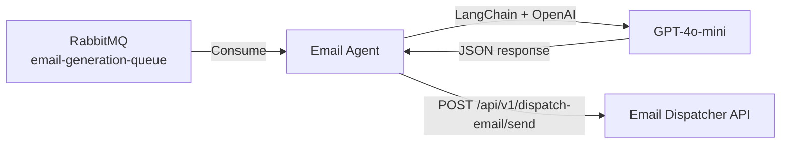

# Email Agent

Serviço Python responsável por consumir mensagens da fila RabbitMQ, gerar conteúdo de e-mail personalizado via IA (OpenAI) e fazer o callback para a API de envio.

## Sumário

- [Visão Geral](#visão-geral)
- [Tecnologias](#tecnologias)
- [Arquitetura](#arquitetura)
- [Fluxo de Funcionamento](#fluxo-de-funcionamento)
- [Estrutura do Projeto](#estrutura-do-projeto)
- [Configuração](#configuração)
- [Como Rodar](#como-rodar)
- [Endpoints](#endpoints)
- [Variáveis de Ambiente](#variáveis-de-ambiente)

---

## Visão Geral

O **Email Agent** é um microserviço que atua como consumidor de mensagens RabbitMQ. Ao receber uma mensagem com dados de um deal/contato, ele utiliza o modelo `gpt-4o-mini` da OpenAI (via LangChain) para gerar um e-mail de marketing personalizado em formato HTML e, em seguida, faz um callback HTTP para a API principal (`email-dispatcher-api`) para que o envio via SMTP seja realizado.

---

## Tecnologias

| Tecnologia | Versão | Uso |
|-----------|--------|-----|
| Python | 3.12+ | Linguagem principal |
| FastAPI | 0.139+ | Framework web (health check) |
| Uvicorn | 0.51+ | Servidor ASGI |
| LangChain | 0.3+ | Orquestração de LLM |
| LangChain OpenAI | 0.3+ | Integração com GPT-4o-mini |
| Pika | 1.4+ | Cliente RabbitMQ (AMQP) |
| HTTPX | 0.28+ | Cliente HTTP assíncrono |
| Ruff | 0.15+ | Linter e formatter (dev) |
| MyPy | 2.2+ | Verificação de tipos (dev) |

---

## Arquitetura



---

## Fluxo de Funcionamento

1. **Startup** — Ao iniciar, o FastAPI sobe um thread daemon que inicia o consumer RabbitMQ.
2. **Consumo** — O consumer escuta a fila `email-generation-queue` e recebe mensagens com dados do deal/contato.
3. **Geração de Conteúdo** — O `EmailAgent` invoca o LLM (GPT-4o-mini) via LangChain com um prompt de marketing, recebendo um JSON com `subject` e `body` (HTML).
4. **Callback** — O agent faz um `POST` para `{SEND_EMAIL_URL}` com o payload `{ toEmail, subject, body }`.
5. **ACK/NACK** — Se o processamento for bem-sucedido, a mensagem é confirmada (`ack`). Em caso de erro, é rejeitada sem requeue (`nack`).

---

## Estrutura do Projeto

```
email-agent/
├── Dockerfile
├── pyproject.toml
├── README.md
└── app/
    ├── __init__.py
    ├── main.py                  ← Entrypoint FastAPI + lifespan
    ├── agent/
    │   ├── __init__.py
    │   └── email_agent.py       ← Lógica de geração de e-mail (LangChain)
    ├── api/
    │   ├── __init__.py
    │   └── routes.py            ← Rotas HTTP (health check)
    ├── core/
    │   ├── __init__.py
    │   └── config.py            ← Configurações e variáveis de ambiente
    └── messaging/
        ├── __init__.py
        ├── connection.py        ← Factory de conexão RabbitMQ
        └── consumer.py          ← Consumer da fila + processamento
```

---

## Configuração

O serviço é configurado exclusivamente via variáveis de ambiente. Os valores padrão permitem execução local sem configuração adicional (exceto `OPENAI_API_KEY`).

---

## Como Rodar

### Com Docker

```bash
docker build -t email-agent .
docker run -d \
  --name email-agent \
  -p 8000:8000 \
  -e RABBITMQ_HOST=rabbitmq \
  -e OPENAI_API_KEY=sua-chave-aqui \
  email-agent
```

### Localmente (Desenvolvimento)

```bash
# Instalar dependências (requer Python 3.12+)
pip install -e .

# Instalar dependências de desenvolvimento
pip install -e ".[dev]"

# Rodar a aplicação
uvicorn app.main:app --host 0.0.0.0 --port 8000 --reload
```

> **Pré-requisito:** RabbitMQ rodando localmente na porta 5672 (veja instruções no README principal do monorepo).

---

## Endpoints

| Método | Path | Descrição |
|--------|------|-----------|
| `GET` | `/api/health` | Health check do serviço |

**Resposta:**
```json
{
  "status": "ok"
}
```

---

## Variáveis de Ambiente

| Variável | Descrição | Padrão |
|----------|-----------|--------|
| `RABBITMQ_HOST` | Host do RabbitMQ | `localhost` |
| `RABBITMQ_PORT` | Porta do RabbitMQ | `5672` |
| `RABBITMQ_USERNAME` | Usuário RabbitMQ | `guest` |
| `RABBITMQ_PASSWORD` | Senha RabbitMQ | `guest` |
| `RABBITMQ_QUEUE` | Nome da fila consumida | `email-generation-queue` |
| `OPENAI_API_KEY` | Chave de API da OpenAI | *(obrigatório)* |
| `SEND_EMAIL_URL` | URL de callback para envio | `http://localhost:8080/api/v1/dispatch-email/send` |

---

## Mensagem Consumida (Input)

Formato da mensagem recebida da fila RabbitMQ:

```json
{
  "email": "destinatario@email.com",
  "title": "Título da Campanha",
  "contactName": "Nome do Contato",
  "note": "Observação sobre o contato",
  "additionalInfo": "Informações adicionais para contexto"
}
```

## Payload Enviado (Callback)

Formato do POST enviado para a API:

```json
{
  "toEmail": "destinatario@email.com",
  "subject": "Assunto gerado pelo LLM",
  "body": "<html>Corpo do e-mail em HTML gerado pelo LLM</html>"
}
```